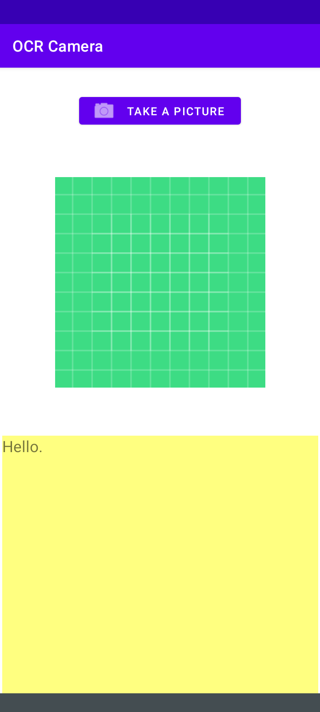
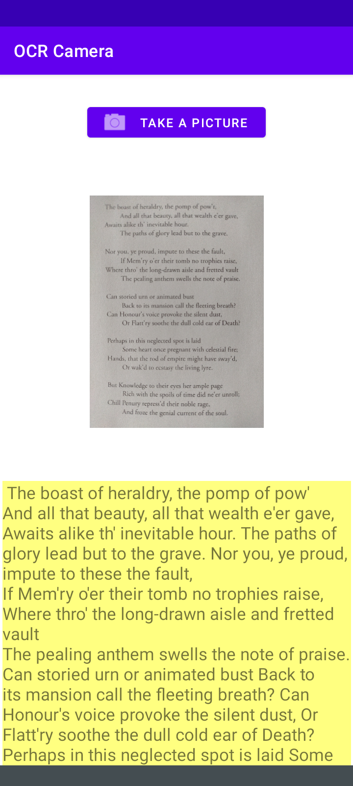

# OCR-Camera
Simple image-to-text app for Android.

## Screenshots

<a href="https://github.com/ncant04/OCR-Camera">
   
</a>
<a href="https://github.com/ncant04/OCR-Camera">
   
</a>

## Dependencies
Google Play services vision libraries
   ```sh
   implementation 'com.google.android.gms:play-services-vision:20.1.3'
   ```
